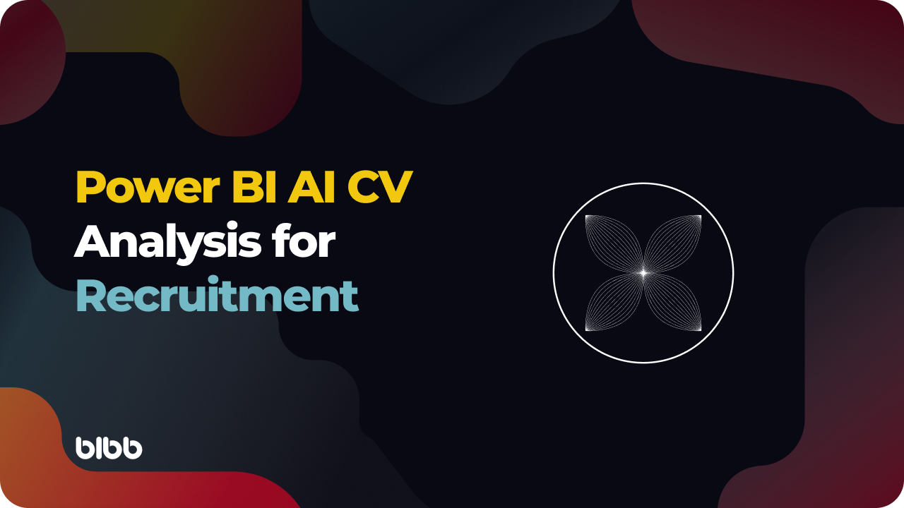
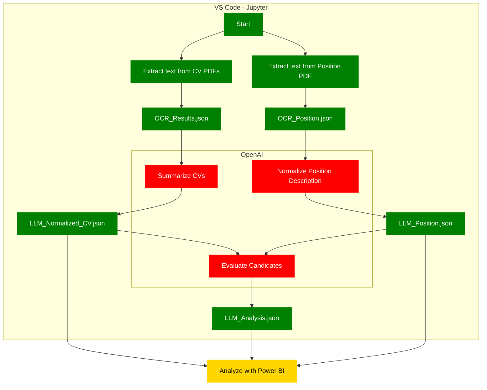

### Legal Considerations of Using LLM on Personal Data

Before implementing AI-driven CV analysis on a productive environment, we advise consulting with a legal specialist to ensure compliance with relevant data protection laws. Key considerations include:

1.  **Consent and Purpose**
    
    -   Obtain clear, explicit consent from individuals before processing their data.
    -   Limit data usage strictly to the recruitment process, avoiding any secondary purposes.
2.  **Data Anonymization**
    
    -   Remove or mask personally identifiable information (PII) before processing CVs to minimize privacy risks.
    -   This includes names, contact details, and other sensitive identifiers.
3.  **Review API Policies**
    
    -   Familiarize yourself with OpenAI's usage policies to avoid transmitting unnecessary sensitive information.
    -   Ensure secure transmission of data to and from the API.
4.  **Bias and Fairness**
    
    -   Regularly review AI outputs for potential bias or unfair patterns in candidate evaluations.
    -   Provide additional checks to ensure all candidates are assessed equitably.
5.  **Security and Transparency**
    
    -   Use encryption to protect data during storage and transmission.
    -   Clearly inform candidates about how AI is used in the recruitment process and provide options to withdraw their data if needed.

## **Project Overview**

The project consists of a Jupyter notebook that:

-   Extract text from PDF files containing candidate CVs and a job position description.
-   Normalize and structure the extracted text using OpenAI's GPT model.
-   Evaluate candidates by matching their CVs against the job position description.
-   Output the results in JSON format for analysis in Power BI.
    
### **Prerequisites**

Before you begin, ensure you have the following:

1.  Installing Python 3.7 or Higher: [Download Python](https://www.python.org/downloads/)
2.  Installing Visual Studio Code (VS Code)
    a.  VS Code Official Download Page: [Download Visual Studio Code](https://code.visualstudio.com/Download)
    b.  [Microsoft: Set up VS Code](https://code.visualstudio.com/docs/setup/setup-overview) - Official setup overview from Microsoft.
3.  Installing Git
    a.  Git for Windows: [Download Git](https://git-scm.com/download/win)
### **Setting up the project**
#### **1. Cloning the GitHub Repository**

If you're unfamiliar with Git, these steps will guide you through cloning the repository using VS Code.

1.  Open VS Code.
2.  Open the Command Palette by pressing Ctrl+Shift+P.
3.  Type "Git: Clone" and select it.
4.  Enter the Repository URL: [https://github.com/OscarValerock/BIBB-PBI-CV-AI-Analysis.git](https://github.com/OscarValerock/BIBB-PBI-CV-AI-Analysis.git)
5.  Choose a Local Directory: Select a folder on your computer to store the project.
6.  Open the Repository: VS Code will prompt you to open the repository once cloned. Click Open.

#### **2. Setting Up a Virtual Environment in VS Code**

Once you've cloned the repository and have your project open in Visual Studio Code, it's best practice to create a virtual environment for your project. This isolates the required Python packages, making your setup more stable and organized. Here's how to do it using the VS Code Command Palette:

-   In the Command Palette (Ctrl+Shift+P), type Python: Create Environment and select Create Environment.
-   VS Code will prompt you to select a folder. Select your project folder (the cloned repository) and choose venv as the virtual environment type.
-   Accept to install the packages from requirements.txt
    

#### **3. Add the Constants.py File**

Create a file named Constants.py in your project's root directory. This file will store your OpenAI API key.

OpenAIKey = "your-openai-api-key"

Important: Replace "your-openai-api-key" with your actual OpenAI API key. Keep this file secure and avoid sharing it publicly.

<!--stackedit_data:
eyJoaXN0b3J5IjpbLTUyNjQ1MjA2NCwtOTYwODcxMzg2LC01Mj
Y0NTIwNjQsMjE3MzExMTY2LDI4MTcyMzQ5OSwtMTkyNjY1ODQ2
MiwxMDg3MDc5MjQ4XX0=
-->