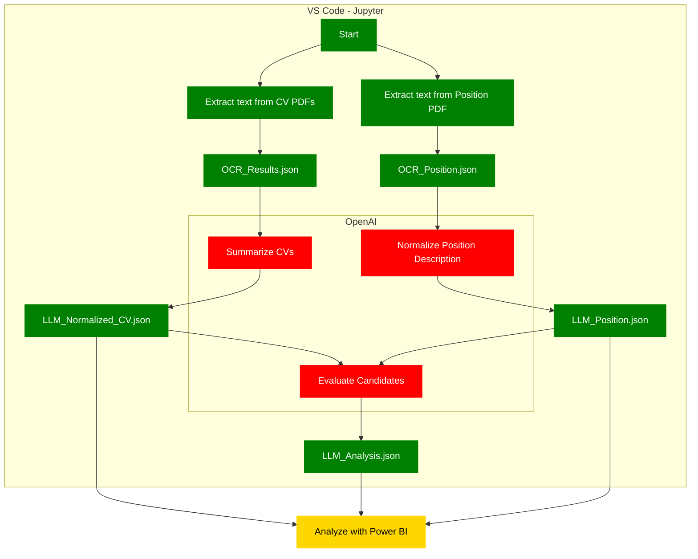

```mermaid
graph TD
    subgraph "VS Code - Jupyter"
        A[Start]
        B[Extract text from CV PDFs]
        A --> B
        B --> C[OCR_Results.json]
        F[Extract text from Position PDF]
        A --> F
        F --> G[OCR_Position.json]
        
        E[LLM_Normalized_CV.json]
        I[LLM_Position.json]
        K[LLM_Analysis.json]
        
        subgraph "OpenAI"
            D[Summarize CVs]
            H[Normalize Position Description]
            J[Evaluate Candidates]
        end
        
        C --> D
        D --> E
        G --> H
        H --> I
        E --> J
        I --> J
        J --> K
    end
    
    E --> L[Analyze with Power BI]
    I --> L
    K --> L
    
    %% Define styles
    classDef openai color:#FFFFFF, fill:#FF0000,stroke:#FF0000,stroke-width:2px;
    classDef vscode color:#FFFFFF, fill:#008000,stroke:#008000,stroke-width:2px;
    classDef powerbi color:#000000, fill:#FFD700,stroke:#FFD700,stroke-width:2px;

    %% Apply styles
    class D,H,J openai
    class A,B,C,E,F,G,I,K vscode
    class L powerbi

    
```