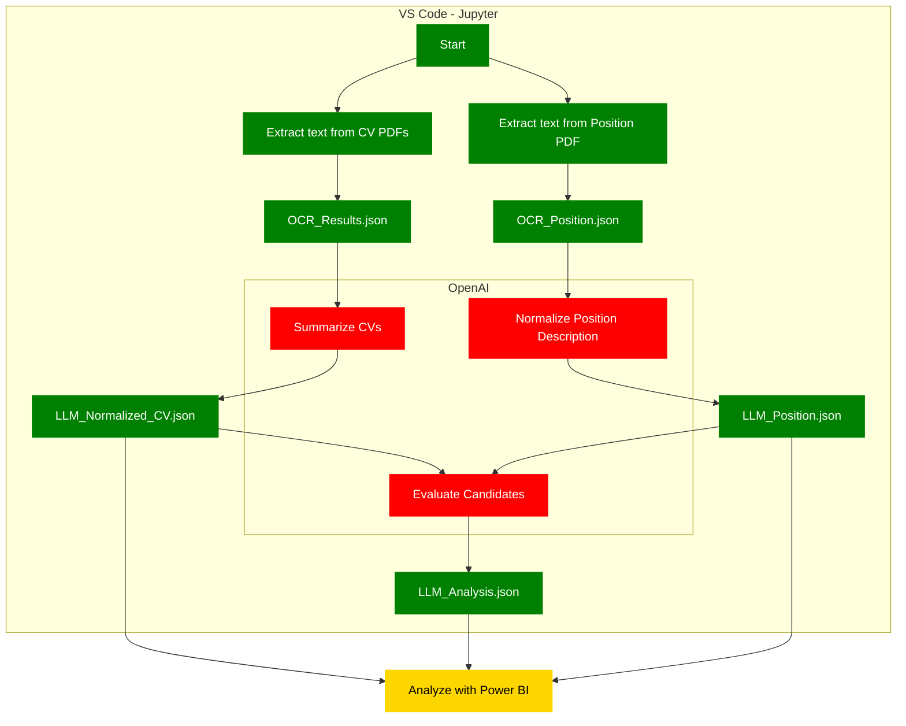

<!DOCTYPE html>
<html lang="en">
<head>
  <meta charset="UTF-8">
  <meta name="viewport" content="width=device-width, initial-scale=1.0">
  <title>Get on GitHub Button</title>
  
</head>
<body>
  <a href="https://github.com/OscarValerock/BIBB-PBI-CV-AI-Analysis" class="github-button" target="_blank" rel="noopener noreferrer">
    <svg class="github-icon" viewBox="0 0 16 16" width="24" height="24" aria-hidden="true">
      <path fill-rule="evenodd" d="M8 0C3.58 0 0 3.58 0 8c0 3.54 2.29 6.53 5.47 7.59.4.07.55-.17.55-.38 0-.19-.01-.82-.01-1.49-2.01.37-2.53-.49-2.69-.94-.09-.23-.48-.94-.82-1.13-.28-.15-.68-.52-.01-.53.63-.01 1.08.58 1.23.82.72 1.21 1.87.87 2.33.66.07-.52.28-.87.51-1.07-1.78-.2-3.64-.89-3.64-3.95 0-.87.31-1.59.82-2.15-.08-.2-.36-1.02.08-2.12 0 0 .67-.21 2.2.82.64-.18 1.32-.27 2-.27.68 0 1.36.09 2 .27 1.53-1.04 2.2-.82 2.2-.82.44 1.1.16 1.92.08 2.12.51.56.82 1.27.82 2.15 0 3.07-1.87 3.75-3.65 3.95.29.25.54.73.54 1.48 0 1.07-.01 1.93-.01 2.2 0 .21.15.46.55.38A8.013 8.013 0 0016 8c0-4.42-3.58-8-8-8z"></path>
    </svg>
    Get this project on GitHub
  </a>
</body>
</html>

### **Project Overview**

The project consists of a Jupyter notebook that:

-   Extract text from PDF files containing candidate CVs and a job position description.
-   Normalize and structure the extracted text using OpenAI's GPT model.
-   Evaluate candidates by matching their CVs against the job position description.
-   Output the results in JSON format for analysis in Power BI.
    
### **Prerequisites**

Before you begin, ensure you have the following:

1.  Installing Python 3.7 or Higher: [Download Python](https://www.python.org/downloads/)
2.  Installing Visual Studio Code (VS Code)
    a.  VS Code Official Download Page: [Download Visual Studio Code](https://code.visualstudio.com/Download)
    b.  [Microsoft: Set up VS Code](https://code.visualstudio.com/docs/setup/setup-overview) - Official setup overview from Microsoft.
3.  Installing Git
    a.  Git for Windows: [Download Git](https://git-scm.com/download/win)
### **Setting up the project**
#### **1. Cloning the GitHub Repository**

If you're unfamiliar with Git, these steps will guide you through cloning the repository using VS Code.

1.  Open VS Code.
2.  Open the Command Palette by pressing Ctrl+Shift+P.
3.  Type "Git: Clone" and select it.
4.  Enter the Repository URL: [https://github.com/OscarValerock/BIBB-PBI-CV-AI-Analysis.git](https://github.com/OscarValerock/BIBB-PBI-CV-AI-Analysis.git)
5.  Choose a Local Directory: Select a folder on your computer to store the project.
6.  Open the Repository: VS Code will prompt you to open the repository once cloned. Click Open.

#### **2. Setting Up a Virtual Environment in VS Code**

Once you've cloned the repository and have your project open in Visual Studio Code, it's best practice to create a virtual environment for your project. This isolates the required Python packages, making your setup more stable and organized. Here's how to do it using the VS Code Command Palette:

-   In the Command Palette (Ctrl+Shift+P), type Python: Create Environment and select Create Environment.
-   VS Code will prompt you to select a folder. Select your project folder (the cloned repository) and choose venv as the virtual environment type.
-   Accept to install the packages from requirements.txt
    

#### **3. Add the Constants.py File**

Create a file named Constants.py in your project's root directory. This file will store your OpenAI API key.

OpenAIKey = "your-openai-api-key"

Important: Replace "your-openai-api-key" with your actual OpenAI API key. Keep this file secure and avoid sharing it publicly.

<!--stackedit_data:
eyJoaXN0b3J5IjpbMTcyNDk3Nzg3MywyODE3MjM0OTksLTE5Mj
Y2NTg0NjIsMTA4NzA3OTI0OF19
-->